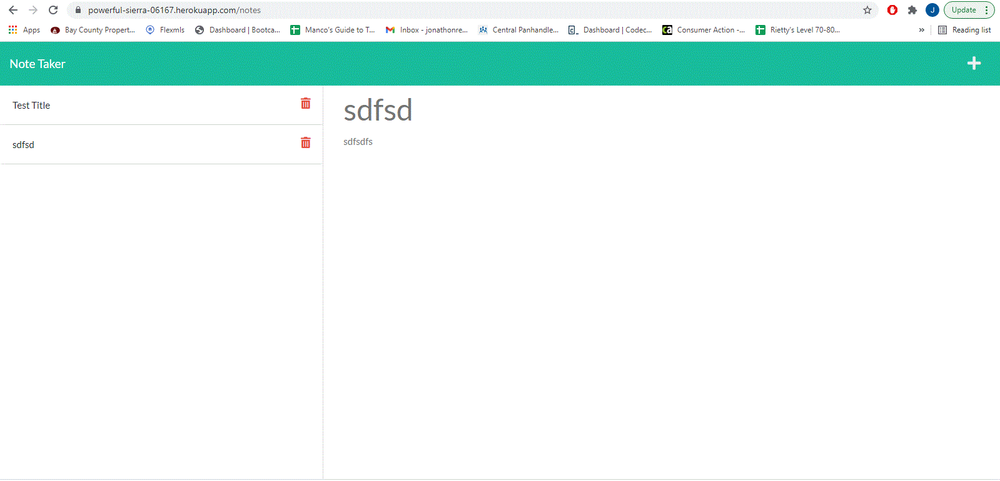
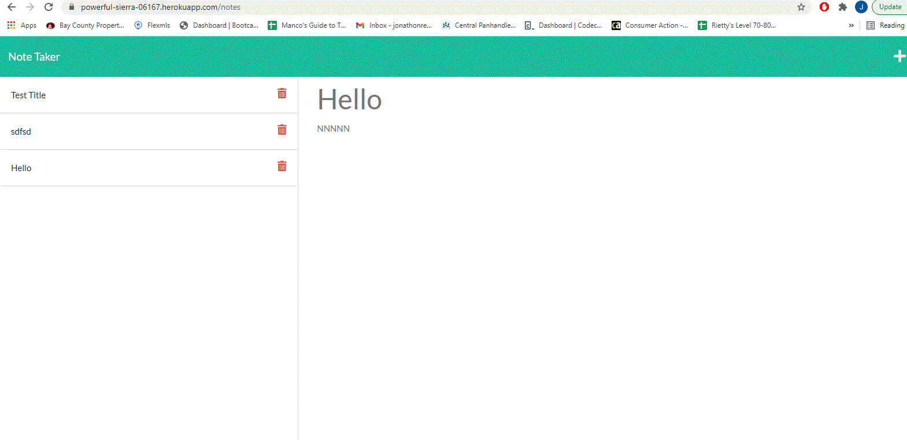

# note_taker

## Description

This is an app that allows a user, including small business owners, to store notes throughout the day of things they might need to do, or to just store information they might need later.  User simply titles the note, and writes what they need to the body text then clicks the save icon.  When the save icon is clicked, it is populated on the left-hand side.  Each note has its own unique id so that it can be viewed again by clicking on it on the left-hand side to show it on the right-hand side.  When the + is clicked and a note is active, it clears out the note and allows a new note to be entered. Future functionality could include the ability to delete the notes by clicking the trashcan image next to the note.

 
## Table of Contents 

* [Usage](#usage)
* [License](#license)
* [Contribution](#contribution)
* [Questions](#questions)
* [Repository](#link-to-repository)
    

## Usage 

This app can be used by clicking on the deployed Heroku link.

[Link to Deployed app on Heroku!](https://powerful-sierra-06167.herokuapp.com/)   

    
## License
This project is licensed under the MIT license.
    
## Contribution 
    
Sole Contributor 

If you wish to make contributions, please contact me below, first.

## Questions
To contact me or report issues, please email me at jonathonrenaud1988@gmail.com
Go to https://github.com/RoomsieJones to view my github profile.    

## Link to Repository
[Link to repository!](https://www.github.com/roomsiejones/note_taker)

